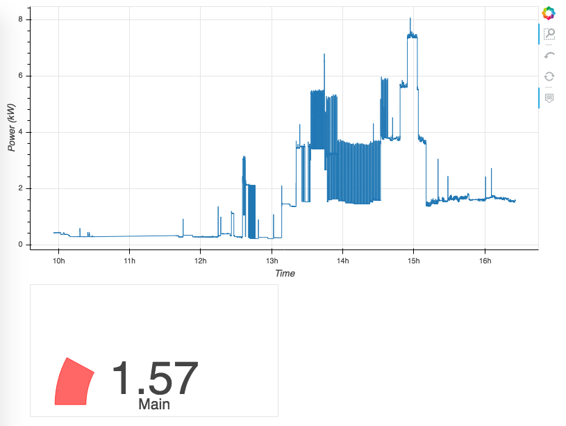

# Home Power Monitoring (aka CorcyPower)

This document details the Home Power  Monitoring System built by a bunch of friends in Saint-Andre-de-Corcy, France.

This system presents an interactive display of the power consumption of the house, with a 1s latency. 



## Hardware

Our home power monitoring system is based on the following hardware: 

* a raspberry pi (3B+ at the moment), under Raspbian Stretch
* an MCP3008 ADC
* an SCT-013-000 non-invasive current sensor
* a custom acquisition board. This board transforms the current signal from the sensor into a voltage signal compatible with the range of the ADC. The signal oscillates around the middle of the range (channel 511), and stays within the ADC range (0-1023) as long as the monitored current is not too large (~50A)

## Software

The software is made of two parts, detailed below. 

The data acquisition script reads the ADC, computes raw values, and stores the information to a database. 

The display script is a web server that retrieves the information from the database and updates interactively. 

Both scripts run as daemons on the pi. 

[Data acquisition: mcp_rms.py](mcp_rms.py) : 

This data acquisition script reads the ADC with the hardware SPI bus of the pi. With its relatively fast hardware bus, the pi is able to accumulate 1000 samples in about 0.5 s. 

Then, various quantities from these samples: 
    * mean: mean ADC count over the 1000 samples. The mean should stay around 511. Any drift would indicate a malfunction. 
    * minadc: minimum ADC count. Can also be used to identify a possible malfunction.
    * maxadc: maximum ADC count. Same.
    * rms: standard deviation of the ADC counts. The intensity is obtained from this value, after calibration. 
  
These values are then stored with the current time in a database.

We first tried mongodb, but the database saturates after a few months. Indeed, due to internal limitations of mongodb on 32 bit systems such as raspbian on the pi, it is not possible to store more than about 2 GB of data in the database. 

We are now moving to sqlite, which is faster and can accomodate as much data as can be stored on the pi SD card. 

[Display server: bokeh_dashboard.py](bokeh_dashboard.py) : 

The display script is based on bokeh and the data analysis is performed with pandas. 

## Installation

To be written 

## Migration from mongodb to sqlite

First make sure that the mcp_rms daemon is running: 

```
sudo systemctl status mcpd
```

You should see something like this. Note that the daemon is active and running. 

```
mcpd.service - Read ADC
   Loaded: loaded (/etc/systemd/system/mcpd.service; enabled; vendor preset: enabled)
   Active: active (running) since Mon 2019-08-26 15:49:07 CEST; 40min ago
 Main PID: 22914 (python)
   CGroup: /system.slice/mcpd.service
           ââ22914 python /home/pi/bin/mcp_rms.py
```

If that's not the case, it's probably because your mongodb is saturated already, so we need to unlock it: 

```
sudo nano /etc/mongodb.conf            # set journal = false
sudo rm -rf /var/lib/mongodb/journal/* # remove the old journal files                                                
sudo rm /var/lib/mongodb/mongod        # remove old stuff   
sudo mongod --dbpath /var/lib/mongodb --repair  # repair the db
sudo chown -R mongodb:mongodb /var/lib/mongodb  # give back the files to the mongodb user
sudo reboot                            # reboot the machine to restart everything
```

Now, update your software from this repository. 

```
cd maldives/power
```

Check that you are on the master branch: 

```
git branch
```

should give: 

```
* master 22c905d [origin/master] cleaning, proper initialization of gauge
```

and make sure you have nothing left to commit: 

```
git s 
```

Then, update your code to the latest version: 

```
git pull origin
```

And finally restart the daemons: 

```
sudo systemctl restart mcpd
sudo systemctl restart dashboard
```

That's it! Your database is now contained in a single file, `/home/pi/power.db`. 
Do not remove it. 

If you want to come back to mongodb for some reason, you can still do it by changing the preferences dictionary in [tools.py](tools.py):

```python
preferences = dict(
    dbtype='sqlite' # or mongodb
)
```

But please note that the mongodb database is deprecated and will soon be removed. 